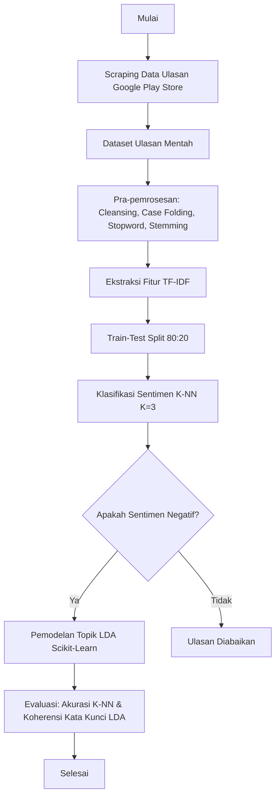
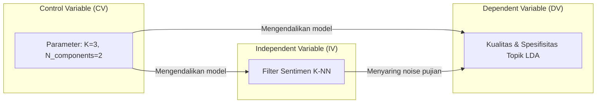

# Arsitektur Eksperimen dan Skema Pengukuran

Penelitian ini tidak mengembangkan perangkat lunak baru (seperti *backend* atau basis data), melainkan merancang sebuah sistem pengukuran (instrumen eksperimen) untuk mengkuantifikasi usabilitas dari sistem *existing*.

## 1. Diagram Alur Eksperimen

Berikut adalah alur bagaimana mahasiswa (responden) berinteraksi dengan instrumen pengukuran hingga menghasilkan data yang siap diolah.

## 2. Pemetaan Variabel ke Komponen Eksperimen

Sistem dirancang secara modular agar objek yang dievaluasi terisolasi dari alat ukurnya.

## 3. Skema Perhitungan System Usability Scale (SUS)

Instrumen pengukuran dalam penelitian ini tidak bergantung pada kuesioner, melainkan pada dua metrik evaluasi matematis dan observasi kualitatif dari algoritma.

A. Pengukuran Klasifikasi K-NN (Confusion Matrix):
Skor performa dihitung berdasarkan jumlah tebakan benar (True Positives & True Negatives) dibagi dengan total seluruh data uji.
*   **Formula Akurasi:** (TP + TN) / (TP + TN + FP + FN) * 100%
*   **Baseline:** Akurasi di atas 70% dianggap layak (acceptable).

B. Pengukuran Topik LDA:
Dievaluasi secara kualitatif dengan menganalisis deretan kata kunci pembentuk topik teratas (Top-N Words) berdasarkan nilai probabilitas distribusinya. Model dinyatakan berhasil jika kata-kata dalam satu topik memiliki koherensi leksikal (contoh: "nelfon", "nomor", "cs" membentuk topik layanan pelanggan).

## 4. Struktur Data dan Skrip Python (sus_calculator.py)

Data teks yang ditarik dari Google Play Store diolah menggunakan skrip Python (eksekusi_model.py) dengan perubahan skema kerangka data (DataFrame) sebagai berikut:

| Kolom | Tipe Data | Deskripsi |
|---|---|---|
| `username` | String | Identitas pembuat ulasan. |
| `score` | Integer (1-5) | Bintang/Rating mentah dari Google Play Store. |
| `content` | String | Teks ulasan asli sebelum dibersihkan. |
| `teks_bersih` | String | Hasil preprocessing (Sastrawi & Regex). |
| `label` | Kategori | Hasil pelabelan awal (Bintang 1-3 = Negatif). |
| `tfidf_weight` | Float | Nilai bobot matriks TF-IDF untuk algoritma. |
| `knn_prediction` | Prediksi sentimen akhir dari algoritma K-NN. |