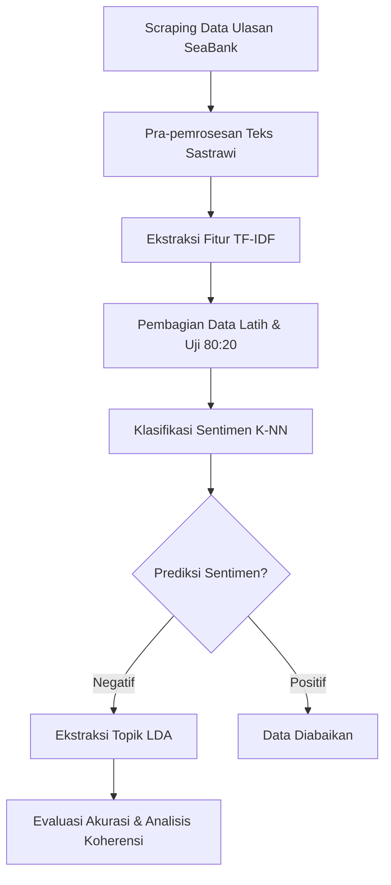

# 04-metodologi

Draf bab metodologi penelitian naskah ilmiah **Tahap 5**.

---

## 3.1 Desain Penelitian dan Unit Analisis

Penelitian ini menggunakan pendekatan kuantitatif dengan desain eksperimental komputasional. Berbeda dengan penelitian yang melibatkan responden manusia, eksperimen pada penelitian ini dijalankan sepenuhnya oleh sistem algoritma pemrosesan teks.

Unit analisis dalam penelitian ini adalah teks ulasan pengguna aplikasi SeaBank yang merepresentasikan opini publik. Variabel independen (IV) dalam penelitian ini adalah penerapan algoritma K-Nearest Neighbors (K-NN) sebagai filter sentimen, yang diposisikan sebagai pra-kondisi sebelum teks diproses lebih lanjut. Variabel dependen (DV) yang diukur adalah kualitas dan spesifisitas klaster topik yang dihasilkan oleh algoritma Latent Dirichlet Allocation (LDA).

## 3.2 Arsitektur Sistem Pengujian

Sistem arsitektur Machine Learning pada penelitian ini dibangun secara sekuensial dan modular, terdiri atas tahapan berikut:

1. Modul Pengumpulan Data (Scraping): Menggunakan pustaka google-play-scraper pada Python untuk menarik ulasan mentah pengguna aplikasi SeaBank secara otomatis dari Google Play Store.
2. Modul Pra-pemrosesan (Preprocessing): Membersihkan teks mentah melalui proses case folding, penghapusan simbol/angka (Regex), stopword removal, dan stemming murni menggunakan pustaka Sastrawi.
3. Modul Ekstraksi Fitur: Mengonversi data teks bersih menjadi bentuk numerik berdimensi tinggi menggunakan metode pembobotan matriks TF-IDF (Term Frequency-Inverse Document Frequency).
4. Modul Klasifikasi (K-NN): Melatih model pembelajaran mesin menggunakan pustaka Scikit-Learn untuk membedakan ulasan bernada positif dan negatif berdasarkan parameter jarak metrik ketetanggaan.
5. Modul Pemodelan Topik (LDA): Menerima umpan data yang secara spesifik telah dilabeli "Negatif" oleh K-NN untuk mencari pola kemunculan kata yang sering berdekatan dan membentuk klaster topik.

### Alur Data Pengujian

### Spesifikasi Environment

| Komponen | Spesifikasi |
|---|---|
| Bahasa Pemrograman | Python 3.x |
| Pustaka NLP & Teks | Sastrawi, NLTK, Regex |
| Pustaka Machine Learning | Scikit-Learn (bukan Gensim) |
| Pustaka Manipulasi Data | Pandas, NumPy |
| Bentuk Keluaran | Matriks Akurasi, Word Cloud, Daftar Kata Kunci Topik |

## 3.3 Variabel, Metrik, dan Prosedur Eksperimen

* **Variabel Kontrol:** Jenis database relasional (MySQL vs PostgreSQL).

**Prosedur pelaksanaan:**
1. Mengimpor 50 ulasan mentah hasil scraping dan membuang entri yang tidak valid hingga menyisakan 44 sampel ulasan bersih.
2. Membagi dataset bersih menggunakan skema Train-Test Split dengan rasio 80% data latih dan 20% data uji.
3. Mengeksekusi pembobotan TF-IDF dan melatih model K-NN pada data latih.
4. Menguji K-NN pada data uji dan mencatat waktu eksekusi komputasi serta tingkat akurasinya.
5. Menyaring ulasan uji yang diprediksi negatif, kemudian meneruskannya ke model LDA.
6. Mengekstraksi daftar kata kunci (top words) dari kedua klaster topik dan melakukan analisis leksikal.

## 3.4 Teknik Analisis Data

Data hasil eksekusi algoritma dievaluasi dengan menggabungkan dua metode pengukuran, yakni metrik matematis dan observasi kualitatif:

1. Pengukuran Klasifikasi K-NN (Confusion Matrix):
Kinerja model diukur menggunakan matriks konfusi untuk mendapatkan persentase akurasi. Akurasi dihitung berdasarkan rasio tebakan yang benar (True Positives dan True Negatives) dibagi total keseluruhan data uji. Performa dianggap berhasil apabila model mampu membedakan sentimen dengan tingkat akurasi tinggi dan waktu komputasi yang efisien (ringan).
2. Pengukuran Topik LDA (Kualitatif & Human Judgement):
Topik dievaluasi dengan meninjau probabilitas distribusi kata-kata penyusun klaster. Evaluasi difokuskan pada tingkat kemasukakalan gabungan kata (koherensi) yang dihasilkan, seperti apakah kata-kata "nelfon", "nomor", dan "cs" secara logis membentuk satu kesatuan topik keluhan layanan pelanggan.
3. Analisis Kegagalan (Failure Analysis):
Tahap ini menganalisis anomali berupa kemunculan kata noise atau bahasa informal (slang seperti "yg", "gua", "udah") pada hasil akhir LDA. Hal ini diidentifikasi sebagai boundary condition (batasan kemampuan) dari pustaka Sastrawi dan dijadikan dasar rekomendasi perancangan Custom Stopword Dictionary pada penelitian mendatang.